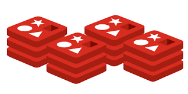

<p align="center">
    
</p>

<h1 align="center">
Distributed Redis
</h1>

Creating a distributed Redis client with Golang and Clustering. The idea is to create a clustering system for Redis clients, maybe a like a load balancer.
Therefore, we can speed up the process of handling clients.

## How to use the project?
Clone the repository and start the balancing server:
```shell
go run main.go
```

This will allow you to send the following http requests:
#### Add a new item named ```mine``` and its value is ```yours```
```shell
curl -X POST -d '{"key": "mine", "value": "yours"}' localhost:8080/api/data 
```

#### Get an item named ```mine```
```shell
curl localhost:8080/api/data/mine 
```

#### Remove an item named ```mine```
```shell
curl -X DELETE localhost:8080/api/data/mine 
```

Each time you make a request, you are using a different server.

## Test
You can set a redis cluster with docker compose:
```shell
docker-compose up -d
```